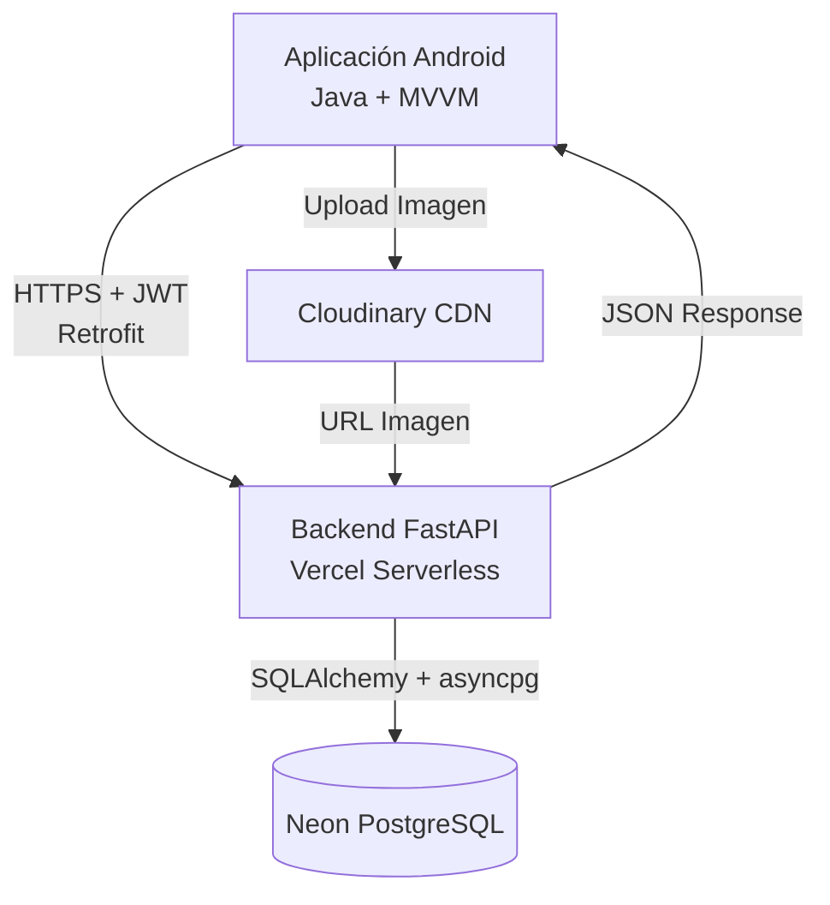
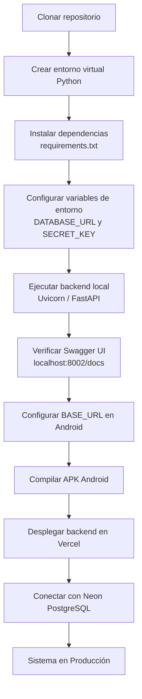
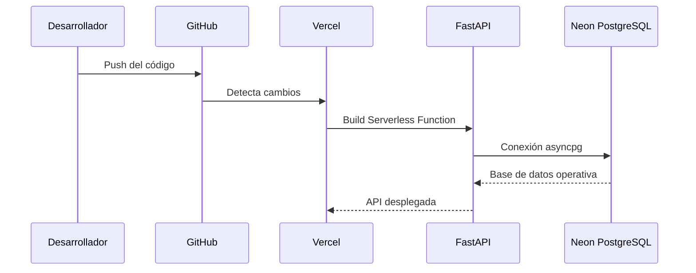

# KERN: Fitness Management System

Este repositorio contiene el proyecto completo **KERN**, una solución integral para la gestión de rutinas de entrenamiento y seguimiento de actividad física desarrollada como Proyecto Intermodular para el grado de **DAM**.

---

## 📄 Documentación Definitiva
La documentación técnica completa, incluyendo el manual de instalación, la arquitectura detallada y el manual de usuario, se encuentra en el siguiente archivo:

👉 **[MEMORIA_PROYECTO_KERN_FINAL.md](./MEMORIA_PROYECTO_KERN_FINAL.md)**

---

## 🚀 ### Configuración de Ejecución Local

### Backend (`/kern-api`)

```bash
# Crear entorno virtual
python -m venv venv

# Activar entorno virtual
# Windows
venv\Scripts\activate

# Linux/macOS
source venv/bin/activate

# Instalar dependencias
pip install -r requirements.txt

# Ejecutar servidor
uvicorn app:app --reload --host 0.0.0.0 --port 8002
```

### Frontend (`/ProyectoIntermodular`)

Configurar la URL de conexión en producción:

```java
private static final String BASE_URL =
    "https://kern-blue.vercel.app/";
```

Para pruebas locales con emulador Android:

```java
private static final String BASE_URL =
    "http://10.0.2.2:8002/";
```

### Tecnologías de Despliegue

| Componente | Tecnología | Función |
|------------|------------|----------|
| Frontend | Android (Java) | Aplicación cliente |
| Backend | FastAPI | API REST |
| Hosting | Vercel | Ejecución serverless |
| Base de Datos | Neon PostgreSQL | Persistencia cloud |
| Multimedia | Cloudinary | Gestión de imágenes |
| Comunicación | Retrofit + HTTPS | Cliente-servidor |

---
## 2.X Despliegue del Sistema

El despliegue de KERN se basa en una arquitectura desacoplada, donde el cliente Android, el backend, la base de datos y el almacenamiento multimedia operan como servicios independientes conectados mediante peticiones HTTPS.

### Arquitectura de Despliegue



### Flujo de Puesta en Producción



### Proceso de Despliegue del Backend



*Desarrollado por Jaime Gayo - I.E.S. Ágora (2026)*
